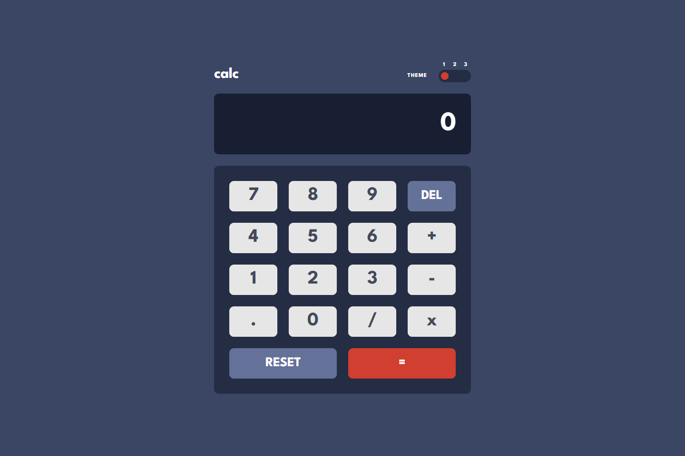
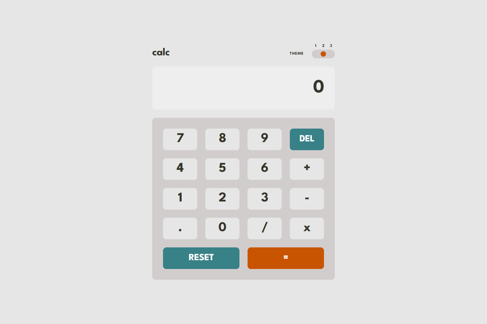
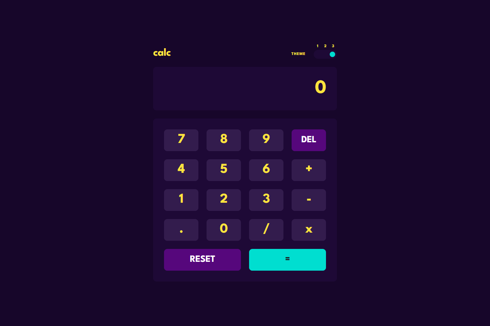
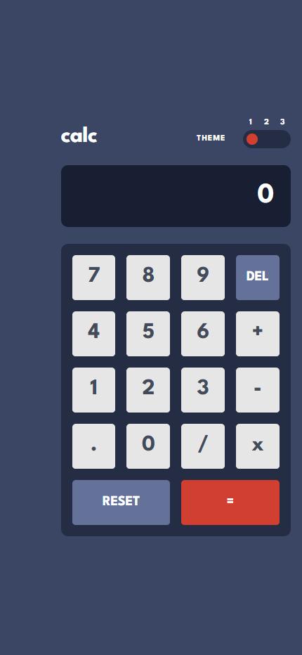

<h1 align="center">🧮 Calc — Tri-Theme Responsive Calculator</h1>

<p align="center">
  <strong>A precision-engineered, pixel-perfect calculator featuring three switchable theme palettes, system color scheme detection, and a float-safe arithmetic engine.</strong>
</p>

<p align="center">
  <a href="https://calculator-app-live.vercel.app">
    
  </a>
  <a href="https://github.com/Eng-MohamedHosny/calculator-app">
    
  </a>
  <a href="https://www.frontendmentor.io/challenges/calculator-app-9lteq5N29">
    
  </a>
</p>

<p align="center">
  
  
  
  
  
</p>

---

## 🌐 Live Production

| Deployment | URL | Status |
| :--- | :--- | :--- |
| **Official Production** | **[https://calculator-app-live.vercel.app](https://calculator-app-live.vercel.app)** |  |
| **GitHub Repository** | **[Eng-MohamedHosny/calculator-app](https://github.com/Eng-MohamedHosny/calculator-app)** |  |
| **Challenge** | [Frontend Mentor — Calculator App](https://www.frontendmentor.io/challenges/calculator-app-9lteq5N29) |  |

---

## 📸 Visual Showcase

### Theme 1: Dark Navy (Classic High-Contrast)


### Theme 2: Light Gray (Clean Minimalist)


### Theme 3: Neon Purple (Cyberpunk Vibrant)


### Mobile Experience (Responsive 375px+)
<p align="center">
  
</p>

---

## ✨ Key Features & Architectural Highlights

### 🎨 1. Three Switchable Themes via CSS Custom Properties
- **Dynamic Semantic Theming:** Implemented with `[data-theme="1|2|3"]` attributes on the root document. All color tokens cascade through CSS custom properties into Tailwind utility classes with zero page flicker.
- **Interactive Sliding Knob:** Custom-built three-position slider with smooth spring-like animation and keyboard arrow key navigation.

### 🌓 2. System Preference Detection & Persistence
- **Zero-Config Onboarding:** Automatically evaluates `window.matchMedia('(prefers-color-scheme: light)')` on the user's first visit (mapping light mode to Theme 2 and dark mode to Theme 1).
- **Persistent Local Storage:** Remembers user theme preferences across browser sessions via `localStorage['calc-theme']`.

### 🧮 3. Precision Float-Safe Arithmetic Engine
- **Eliminates Binary Float Hazards:** Solves notorious JavaScript IEEE 754 precision errors (such as `0.1 + 0.2 = 0.30000000000000004`) using precision-controlled reduction and fractional normalization.
- **State Machine Reducer:** Fully decoupled business logic managed with React `useReducer` to handle edge cases like chained operations, operand buffering, decimal guards, and sign inversion.

### 🛡️ 4. Division-by-Zero Guard & Error Recovery
- **Safe Evaluation:** Dividing by zero cleanly triggers an interactive `Error` screen state that automatically clears and recovers on the subsequent keystroke.

### ⌨️ 5. Comprehensive Physical Keyboard Support
- **Full Key Mapping:** Accepts standard keyboard and numpad keystrokes:
  - `0` - `9`: Numerical input
  - `.` / `,`: Decimal point insertion
  - `+`, `-`, `*`, `/`: Mathematical operators
  - `Enter` / `=`: Evaluate equation
  - `Backspace` / `Delete`: Delete last entered digit (`DEL`)
  - `Escape` / `c`: Reset calculator (`RESET`)

### ♿ 6. Accessible by Design (WCAG 2.1 AA)
- **Live Status Announcement:** Calculation results announced dynamically via `role="status"` and `aria-live="polite"`.
- **Keyboard Traversal:** Complete keyboard focus rings (`focus-visible:ring-2`) and ARIA radiogroups (`role="radiogroup"` / `role="radio"`) for full screen-reader compliance.

---

## 🎨 Design Token Architecture

Extracted directly from the official Figma design files with exact 3D tactile button depth:

### Palette Tokens

| Theme | Main Background | Screen Background | Keypad Background | Del/Reset Key | Equals Accent | Digit Key |
|---|---|---|---|---|---|---|
{{ ... }}
| **DEL / RESET** | `#647198` / `#a2b2e1` <br> Shadow: `#414e73` | `#378187` / `#62b5bc` <br> Shadow: `#1b6066` | `#56077c` / `#8631af` <br> Shadow: `#be15f4` |
| **Equals (=)** | `#d03f2f` / `#f96b5b` <br> Shadow: `#93261a` | `#c85402` / `#ff8a38` <br> Shadow: `#873901` | `#00ded0` / `#93fff8` <br> Shadow: `#6cf9f1` |

---

## 🛠️ Tech Stack & Tools

- **Core Framework:** [React 18](https://react.dev/)
- **Build Tool:** [Vite 5](https://vitejs.dev/)
- **Styling:** [Tailwind CSS 3](https://tailwindcss.com/)
- **Icons:** [Lucide React](https://lucide.dev/)
- **Typography:** [League Spartan](https://fonts.google.com/specimen/League+Spartan) (Weight: 700)
- **Hosting & Edge Network:** [Vercel](https://vercel.com/)

---

## 🚀 Getting Started

### Prerequisites
- [Node.js](https://nodejs.org/) (v18 or higher)
- [npm](https://www.npmjs.com/) or [yarn](https://yarnpkg.com/)

### Installation

1. **Clone the repository:**
   ```bash
   git clone git@github.com:Eng-MohamedHosny/calculator-app.git
   cd calculator-app
   ```

2. **Install dependencies:**
   ```bash
   npm install
   ```

3. **Start local development server:**
   ```bash
   npm run dev
   ```
   Open `http://localhost:5173` in your browser.

4. **Build for production:**
   ```bash
   npm run build
   ```

5. **Preview production build:**
   ```bash
   npm run preview
   ```

---

## 📁 Project Structure

```text
├── screenshots/
│   ├── desktop-preview.png     # Desktop preview screenshot
│   ├── theme-1.png             # Theme 1: Dark Navy
│   ├── theme-2.png             # Theme 2: Light Gray
│   ├── theme-3.png             # Theme 3: Purple Neon
│   └── mobile-preview.png      # Mobile preview screenshot
├── src/
│   ├── components/
│   │   ├── Header.jsx          # Header with logo & ThemeSwitcher container
│   │   ├── Keypad.jsx          # Interactive 18-key calculator keypad grid
│   │   ├── Screen.jsx          # Formatted number display with ARIA live region
│   │   └── ThemeSwitcher.jsx   # 3-position sliding knob with keyboard accessibility
│   ├── lib/
│   │   └── calculator.js       # State machine reducer, float-safe arithmetic engine
│   ├── App.jsx                 # Top-level state coordinator & keyboard listeners
│   ├── index.css               # CSS Custom Properties theme tokens & font imports
│   └── main.jsx                # Application bootstrap entry point
├── index.html                  # HTML document with Google Fonts
├── tailwind.config.js          # Design token mapping & semantic theme utility layer
├── vite.config.js              # Vite bundler configuration
└── README.md                   # Project documentation
```

---

## 👤 Author

**Mohamed Hosny**
- **Frontend Mentor:** [@Eng-MohamedHosny](https://www.frontendmentor.io/profile/Eng-MohamedHosny)
- **GitHub:** [@Eng-MohamedHosny](https://github.com/Eng-MohamedHosny)
- **Live Demo:** [https://calculator-app-live.vercel.app](https://calculator-app-live.vercel.app)

---

## 📄 License

This project is licensed under the [MIT License](LICENSE).
