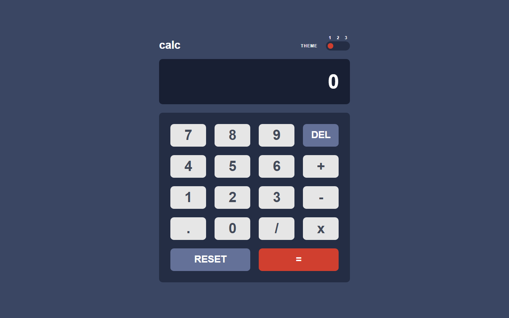

# Frontend Mentor - Calculator App Solution

[](https://www.frontendmentor.io/challenges/calculator-app-9lteq5N29)
[](https://calculator-app-9lteq5n29.vercel.app)
[](https://github.com/Eng-MohamedHosny/calculator-app-9lteq5N29)
[](https://react.dev/)
[](https://tailwindcss.com/)
[](https://vitejs.dev/)

A pixel-perfect, responsive solution to the [Frontend Mentor Calculator App challenge](https://www.frontendmentor.io/challenges/calculator-app-9lteq5N29). Built with React 18, Tailwind CSS, and Vite, featuring 3 switchable theme color schemes, system preference detection, persistent local storage, and a float-safe arithmetic engine.

---

## 📸 Previews

### Desktop Preview (1440px)


### Mobile Preview (375px)
<p align="center">
  
</p>

---

## 📑 Table of Contents

- [Overview](#overview)
  - [The Challenge](#the-challenge)
  - [Key Features](#key-features)
- [Design Token Architecture](#design-token-architecture)
  - [Palette Tokens](#palette-tokens)
  - [Authoritative Button Matrix](#authoritative-button-matrix)
- [Technical Highlights](#technical-highlights)
- [Project Structure](#project-structure)
- [Getting Started](#getting-started)
  - [Installation](#installation)
  - [Development](#development)
  - [Production Build](#production-build)
- [Accessibility & Keyboard Navigation](#accessibility--keyboard-navigation)
- [Author](#author)

---

## 🔍 Overview

### The Challenge

Users should be able to:
- See the size of the elements adjust based on their device's screen size (responsive from 320px to large screens).
- Perform mathematical operations including addition, subtraction, multiplication, and division.
- Adjust the color theme among three distinct palettes (Theme 1: Dark Navy, Theme 2: Light Gray, Theme 3: Purple Neon).
- **Bonus**: Have their initial theme preference detected using `prefers-color-scheme` (dark mode initiates Theme 1, light mode initiates Theme 2) and persist manual selections across sessions with `localStorage`.

### Key Features

- 🎨 **3 Switchable Themes**: Implemented via CSS Custom Properties on `[data-theme]` attributes.
- 🌓 **Theme Intelligence**: Automatically honors `prefers-color-scheme` on first visit and persists changes to `localStorage['calc-theme']`.
- 🧮 **Float-Safe Arithmetic Engine**: Prevents JavaScript binary floating-point errors (e.g. `0.1 + 0.2 = 0.30000000000000004`) via precision truncation and controlled operation reduction.
- 🛡️ **Zero-Division & Error Resilience**: Gracefully traps division by zero, displaying an interactive `Error` state that recovers upon subsequent user input.
- ⌨️ **Full Keyboard Support**: Seamlessly accepts numeric input, operator keystrokes (`+`, `-`, `*`, `/`), `Enter` or `=` for evaluation, `Backspace` for deletion, and `Escape` for reset.
- ♿ **ARIA & WCAG 2.1 Compliant**: Live regions for calculation updates (`role="status"`, `aria-live="polite"`), labeled inputs and theme switchers (`role="radiogroup"` / `role="radio"`), and visible focus rings for full accessibility.

---

## 🎨 Design Token Architecture

Extracted verbatim from Figma Dev Mode inspection (`DESIGN_SPECS.md`).

### Palette Tokens

| Theme | Main Background | Screen Background | Keypad Background | Del/Reset Key | Equals Accent | Digit Key |
|---|---|---|---|---|---|---|
| **1. Dark Navy** | `#3a4663` | `#181f33` | `#242d44` | `#647198` | `#d03f2f` | `#e6e6e6` |
| **2. Light Gray** | `#e6e6e6` | `#eeeeee` | `#d2cdcd` | `#378187` | `#c85402` | `#e6e6e6` |
| **3. Purple Neon** | `#17062a` | `#1e0936` | `#1e0936` | `#56077c` | `#00ded0` | `#331c4d` |

### Authoritative Button Matrix

Each key features 3D depth with an inset shadow (`box-shadow: inset 0 -4px 0 <color>`) and interactive hover states:

| Key Type | Theme 1 Default / Hover | Theme 2 Default / Hover | Theme 3 Default / Hover |
|---|---|---|---|
| **Digit / Operator** | `#e6e6e6` / `#ffffff` <br> Shadow: `#b3a497` | `#e6e6e6` / `#ffffff` <br> Shadow: `#a79e91` | `#331c4d` / `#6c34ac` <br> Shadow: `#881c9e` |
| **DEL / RESET** | `#647198` / `#a2b2e1` <br> Shadow: `#414e73` | `#378187` / `#62b5bc` <br> Shadow: `#1b6066` | `#56077c` / `#8631af` <br> Shadow: `#be15f4` |
| **Equals (=)** | `#d03f2f` / `#f96b5b` <br> Shadow: `#93261a` | `#c85402` / `#ff8a38` <br> Shadow: `#873901` | `#00ded0` / `#93fff8` <br> Shadow: `#6cf9f1` |

---

## ⚡ Technical Highlights

- **CSS Variables & Tailwind Integration**: Dynamic theming without heavy style duplication. The root element binds semantic CSS tokens mapped into Tailwind's utility layer.
- **State Machine Reducer**: Calculator logic is encapsulated in a pure reducer function handling complex state transitions (operand buffering, chained evaluations, and decimal guards).
- **Format-Preserving Display**: Dynamic comma formatting (locale thousand separators) applied to operands while typing and upon result display, with safety caps against layout overflow.

---

## 📁 Project Structure

```text
calculator-app-9lteq5N29/
├── public/               # Static assets & favicon
├── screenshots/          # High-resolution desktop & mobile preview images
│   ├── desktop-preview.png
│   └── mobile-preview.png
├── src/
│   ├── components/       # UI components (Header, Screen, Keypad, Key)
│   ├── hooks/            # Custom hooks (useCalculator, useTheme, useKeyboard)
│   ├── types/            # TypeScript / interface definitions
│   ├── utils/            # Calculation engine & number formatters
│   ├── App.jsx           # Root layout & composition
│   ├── index.css         # CSS variables & Tailwind directives
│   └── main.jsx          # React DOM entrypoint
├── DESIGN_SPECS.md       # Exact Figma Dev Mode specifications
├── index.html            # HTML entry point with font preloads
├── package.json          # Dependencies and npm scripts
├── tailwind.config.js    # Custom token configuration
└── vite.config.js        # Vite build tool configuration
```

---

## 🚀 Getting Started

### Installation

Clone the repository and install dependencies:

```bash
git clone https://github.com/Eng-MohamedHosny/calculator-app-9lteq5N29.git
cd calculator-app-9lteq5N29
npm install
```

### Development

Start the local development server:

```bash
npm run dev
```

### Production Build

Create an optimized production build:

```bash
npm run build
```

Preview the production build locally:

```bash
npm run preview
```

---

## ⌨️ Accessibility & Keyboard Navigation

The calculator is completely operable via keyboard:
- `0` - `9`: Numeric input
- `.`: Decimal separator (guarded against duplicate decimals)
- `+`, `-`, `*`, `/`: Arithmetic operators
- `Enter` or `=`: Calculate result
- `Backspace`: Delete last digit (`DEL`)
- `Escape`: Clear / reset calculator (`RESET`)
- `Tab` / `Shift + Tab`: Navigate between theme switch options and keypad buttons
- `Space`: Activate focused key

---

## 👨‍💻 Author

- **Mohamed Hosny** - [@Eng-MohamedHosny](https://github.com/Eng-MohamedHosny)
- Frontend Mentor Profile: [@Eng-MohamedHosny](https://www.frontendmentor.io/profile/Eng-MohamedHosny)
